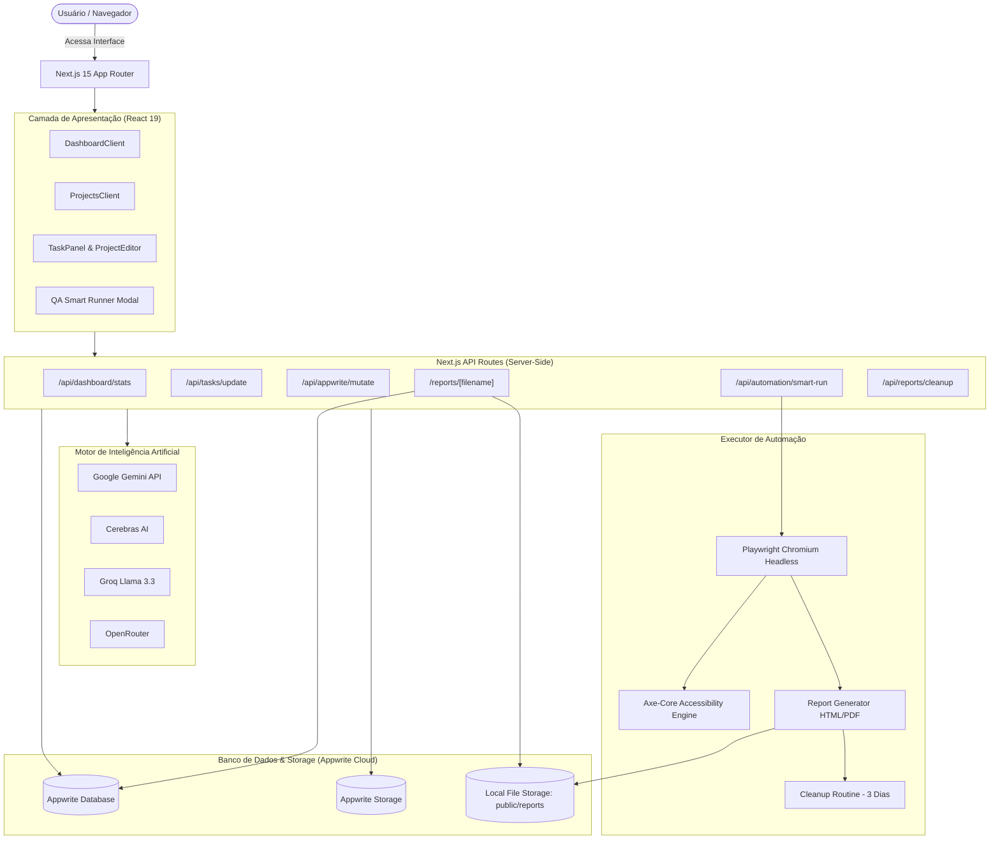
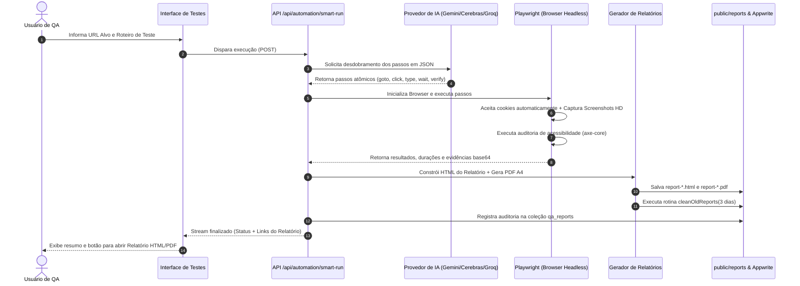
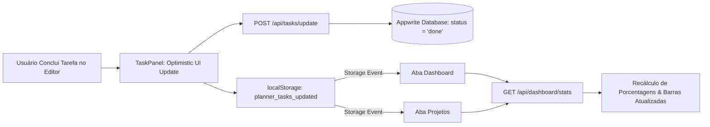

# 🚀 Planner & QA Automation Suite

<p align="center">
  <strong>Plataforma Completa de Gestão Estratégica de Projetos, Tarefas, Documentação e Automação de Testes de QA com Inteligência Artificial.</strong>
</p>

<p align="center">
  
  
  
  
  
  
  
</p>

---

## 📖 Visão Geral

O **Planner** é um ecossistema completo para planejamento, gestão e validação de qualidade de software. Ele integra gestão de projetos hierárquicos (projetos e subprojetos), checklists dinâmicos de tarefas, documentação técnica rica e um executor de testes automatizados inteligente (**Smart Runner**) baseado em Playwright e múltiplos provedores de IA.

---

## ✨ Principais Funcionalidades

### 📊 1. Dashboard em Tempo Real
* **Métricas em Tempo Real:** Acompanhamento instantâneo de Projetos Ativos, Tarefas Pendentes e Progresso Global consolidado.
* **Agrupamento Inteligente:** Projetos principais exibem cards consolidados com seus subprojetos aninhados, mini barras de progresso individuais e totalizadores.
* **Sincronização Instantânea (Cross-Tab Sync):** Alterações feitas em tarefas ou projetos em qualquer aba são refletidas imediatamente no Dashboard via eventos de armazenamento e detecção de visibilidade.
* **Feed de Atividades:** Histórico dinâmico de projetos atualizados e tarefas concluídas.

### 📂 2. Gestão Hierárquica de Projetos & Subprojetos
* **Estrutura Pai-Filho (Tree View):** Subprojetos não poluem a visualização raiz; são agrupados dentro do projeto pai com indicador expansível (`X sub`).
* **Progresso Proporcional:** A taxa de conclusão do projeto pai reflete o somatório das entregas do projeto e de todos os seus subprojetos.
* **Ações em Lote e Exclusão Rápida:** Exclusão individual de 1 clique ou exclusão em massa com limpeza definitiva no banco de dados.

### ✅ 3. Painel de Tarefas & Checklist
* **Ciclo de Estados:** Transição rápida entre `A fazer (todo)`, `Em progresso (in_progress)`, `Concluído (done)` e `Cancelado (cancelled)`.
* **Priorização & Datas:** Definição de prioridades (`alta`, `média`, `baixa`) e datas limites de entrega (`due_date`).
* **Persistência Segura:** Atualizações de tarefas via endpoints dedicados com fallback resiliente para identificadores no Appwrite.

### 🤖 4. Automação de QA & Smart Runner (Playwright + IA)
* **Geração Inteligente de Passos:** Converte descrições em linguagem natural (PT-BR) ou especificações técnicas em passos executáveis do Playwright.
* **Suporte a Multi-Provedores de IA:** Integração com Google Gemini, Cerebras AI, Groq, Mistral AI e OpenRouter com alternância automática (fallback).
* **Auditoria de Acessibilidade:** Execução embutida do motor `axe-core` para detecção de violações de acessibilidade (WCAG).
* **Evidências Visuais em Alta Definição:** Captura automática de screenshots (antes da ação, highlight do elemento e tela cheia).
* **Relatórios Automatizados:** Geração de relatórios completos em formato **HTML** e **PDF** com layout executivo.
* **Limpeza Automática de 3 Dias:** Rotina de retenção que remove automaticamente relatórios locais e registros do banco com mais de 3 dias de criação.

### 📝 5. Páginas & Base de Conhecimento
* Editor de documentação técnica por projeto com suporte a notas, especificações de requisitos e insights contextuais gerados por IA.

---

## 📐 Arquitetura do Sistema



---

## 🔄 Fluxograma do Smart Runner (Automação de QA)



---

## ⚡ Fluxograma de Sincronização em Tempo Real (Cross-Tab Sync)



---

## 📁 Estrutura do Projeto

```plaintext
planner/
├── app/
│   ├── (app)/
│   │   ├── dashboard/          # Dashboard Principal com Métricas e Feed
│   │   ├── projects/           # Listagem Hierárquica de Projetos
│   │   │   └── [id]/           # Editor do Projeto (Tarefas, Docs, Automação)
│   │   ├── settings/           # Configurações de Perfil e Integrações
│   │   └── layout.tsx          # Layout Principal da Aplicação
│   ├── api/
│   │   ├── ai/                 # Endpoints de IA (Insights, Organograma, etc)
│   │   ├── appwrite/mutate/    # Proxy seguro de mutações no banco
│   │   ├── auth/               # Endpoints de Sessão e Autenticação
│   │   ├── automation/         # Execução Playwright e Smart Runner
│   │   ├── dashboard/stats/    # Estatísticas e Métricas em Tempo Real
│   │   ├── reports/cleanup/    # Endpoint de Limpeza Automática de 3 Dias
│   │   └── tasks/update/       # Atualização Segura de Tarefas
│   ├── reports/[filename]/     # Rota Dinâmica de Entrega e Reconstrução de Relatórios
│   └── page.tsx                # Landing Page / Redirecionamento
├── components/
│   ├── dashboard/              # Cards, Modais, TaskPanel, NewProjectModal
│   ├── layout/                 # Sidebar, Topbar, ThemeToggle, Navegação
│   └── ui/                     # Componentes Base (Botões, Badges, Inputs)
├── lib/
│   ├── appwrite/               # Configuração, REST Client e Supabase Shim Adapter
│   ├── automation/             # Parsers de scripts e roteiros em linguagem natural
│   ├── utils/                  # Utilitários gerais e rotina cleanOldReports
│   └── worker/                 # Executor de testes, Gerador de Relatório HTML/PDF
├── public/
│   └── reports/                # Armazenamento temporário de relatórios HTML/PDF
├── types/                      # Definições TypeScript (Project, Task, etc)
├── .env                        # Variáveis de Ambiente
├── package.json                # Dependências e Scripts
└── README.md                   # Documentação do Projeto
```

---

## 🛠️ Tecnologias Utilizadas

* **Framework:** [Next.js 15 (App Router)](https://nextjs.org/)
* **Linguagem:** [TypeScript 5](https://www.typescriptlang.org/)
* **Interface & Estilização:** [Tailwind CSS](https://tailwindcss.com/), [Framer Motion](https://www.framer.com/motion/) e [Lucide Icons](https://lucide.dev/)
* **Banco de Dados & Auth:** [Appwrite Cloud REST API](https://appwrite.io/)
* **Automação & Browser Testing:** [Playwright](https://playwright.dev/) & [Axe-Core](https://github.com/dequelabs/axe-core)
* **Modelos de IA Suportados:**
  * Google Gemini (`gemini-flash-latest`, `gemini-1.5-pro`)
  * Cerebras (`llama-3.3-70b`)
  * Groq (`llama-3.3-70b-versatile`)
  * Mistral AI (`mistral-small-latest`)
  * OpenRouter (`llama-3.3-70b-instruct`)

---

## ⚙️ Variáveis de Ambiente (`.env`)

Crie um arquivo `.env` na raiz do projeto com as seguintes chaves:

```env
# --- Appwrite Cloud ---
NEXT_PUBLIC_APPWRITE_ENDPOINT=https://nyc.cloud.appwrite.io/v1
NEXT_PUBLIC_APPWRITE_PROJECT_ID=seu_project_id
APPWRITE_API_KEY=sua_secret_api_key_appwrite
APPWRITE_DATABASE_ID=planner_db

# --- Coleções Appwrite ---
APPWRITE_COLLECTION_PROJECTS=projects
APPWRITE_COLLECTION_TASKS=tasks
APPWRITE_COLLECTION_PAGES=pages
APPWRITE_COLLECTION_INSIGHTS=ai_insights
APPWRITE_COLLECTION_QA_REPORTS=qa_reports

# --- Provedores de Inteligência Artificial ---
GEMINI_API_KEY=sua_chave_google_gemini
CEREBRAS_API_KEY=sua_chave_cerebras
GROQ_API_KEY=sua_chave_groq
MISTRAL_API_KEY=sua_chave_mistral
OPENROUTER_API_KEY=sua_chave_openrouter
```

---

## 🚀 Como Executar o Projeto

### 1. Pré-requisitos
* **Node.js:** Versão 18.18+ ou 20+ instalada.
* **NPM** ou **Yarn**.

### 2. Instalação das Dependências
```bash
npm install
```

### 3. Instalação dos Navegadores do Playwright (para testes de QA)
```bash
npx playwright install chromium
```

### 4. Executando em Modo de Desenvolvimento
```bash
npm run dev
```
Acesse no navegador: **`http://localhost:3000`**

### 5. Build para Produção
```bash
npm run build
npm run start
```

---

## 📄 Licença

Este projeto é desenvolvido para planejamento, gestão e automação de qualidade de software. Todos os direitos reservados.
